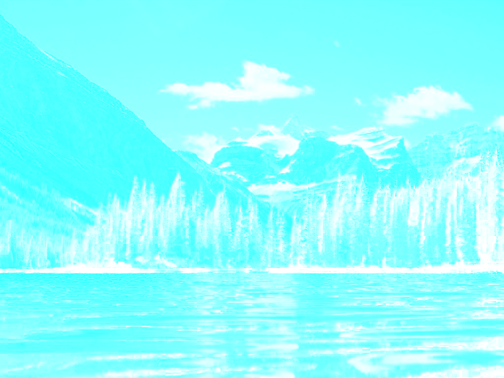
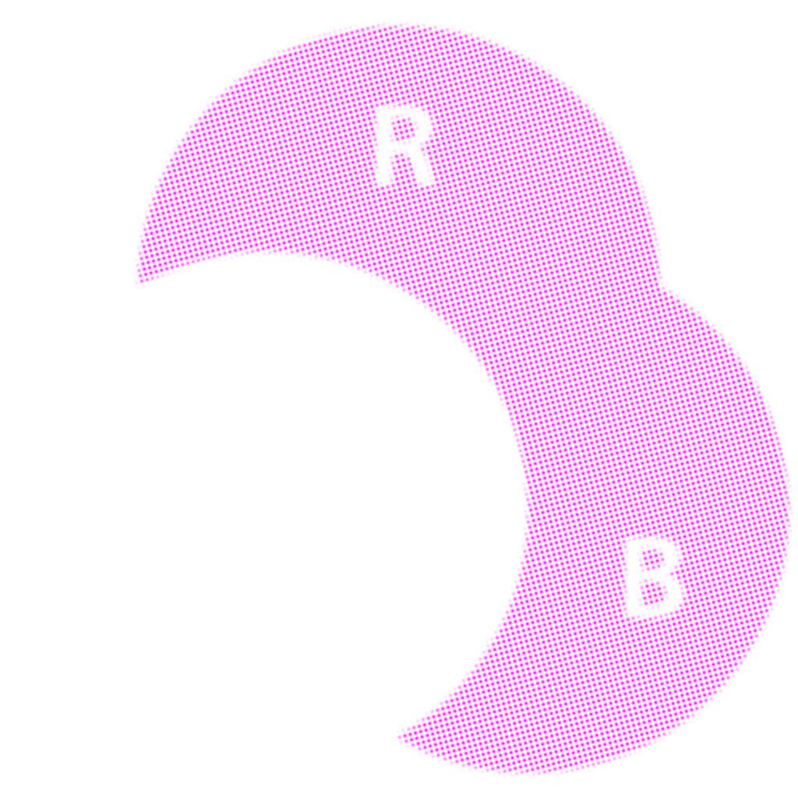
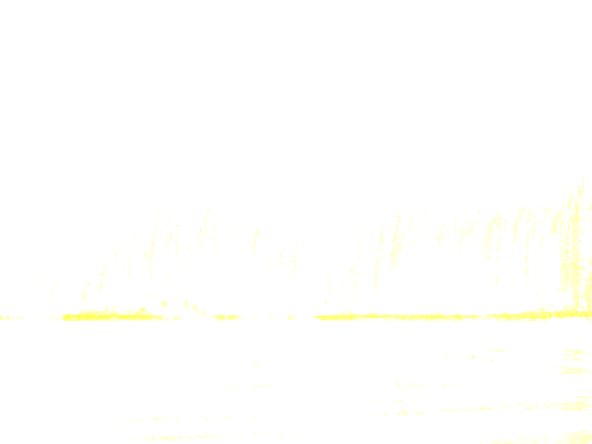
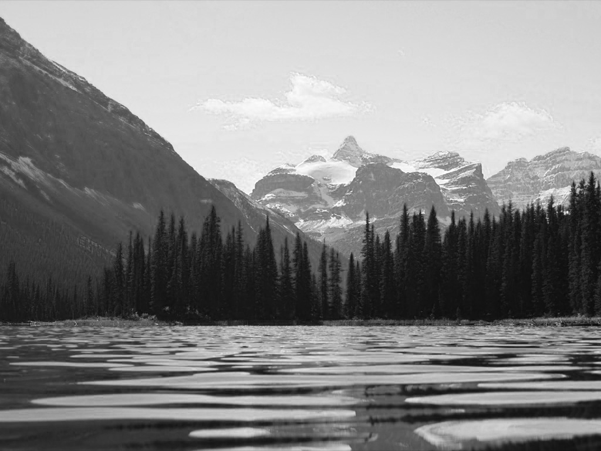
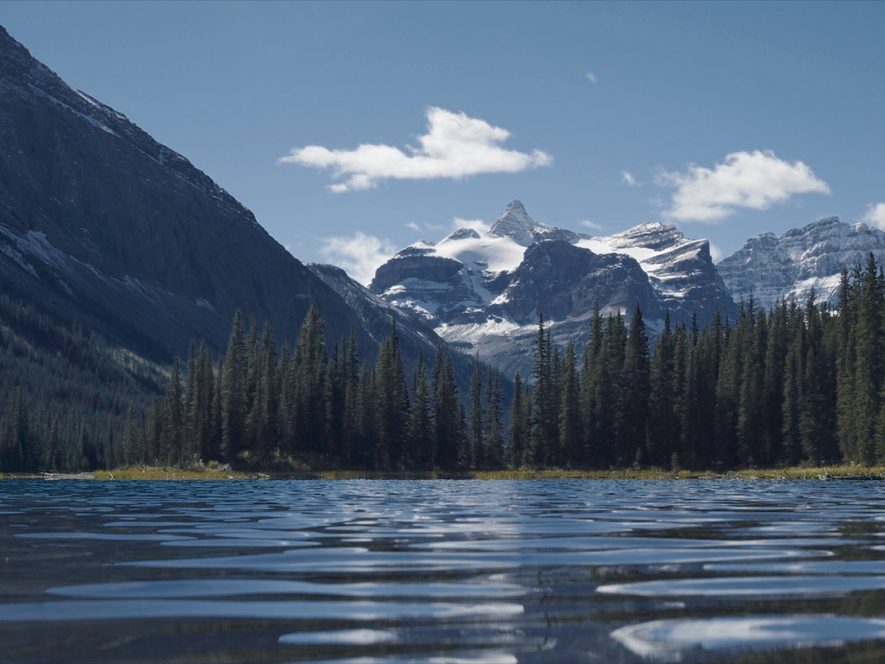

# python-halftone

A python module that uses creates CMYK images and halftone representations

Heavily adapted from [this StackOverflow answer][so] by [fraxel][fr] and [this code][gh] by [Phil Gyford][pg]

[pil]: http://www.pythonware.com/products/pil/
[so]: http://stackoverflow.com/questions/10572274/halftone-images-in-python/10575940#10575940
[fr]: http://stackoverflow.com/users/1175101/fraxel
[gh]: https://github.com/philgyford/python-halftone
[pg]: https://github.com/philgyford

## Usage

    ./haltone.py "filename"

Creates four CMYK images and a combined image.  Provides options for haltoning or not (-d)

| OPTION 				 | DESCRIPTION                                     | Default | 
| ---------------------- | ----------------------------------------------- | ------- | 
| -h, --help             | show this help message and exit                 | n/a     | 
| -b, --bits {1,2,4,6,8} | bits of color info per channel                  | 8       | 
| -c, --colorize_CMYK    | save CMYK files as RGB color images             | False   | 
| -d, --do_not_halftone	 | don't do halftoning                             | False   | 
| -e, --extra_file_name  | final name addition for each channel            | "_Clr"  | 
| -f, --fill  			 | dot fill (size) value                           | 0.5     | 
| -g, --gray  			 | percent of grey component replacement (K level) | 100     | 
| -p, --sharpness  		 | level of sharpness of the dots                  | 1.0     | 
| -s, --size  			 | half size of averaging region (pixels)          | 3       | 

## Examples

|               | Haltoned                           | CMYK Only                            | 
| ------------- | :--------------------------------: | :----------------------------------: | 
| Original      |   |   | 
| C-Channel     |     |     |
| M-Channel     |     |     |
| Y-Channel     |     |     |
| K-Channel     |     |     |
| Combined CMYK |  |  |

